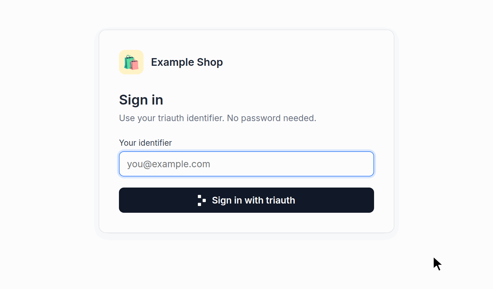
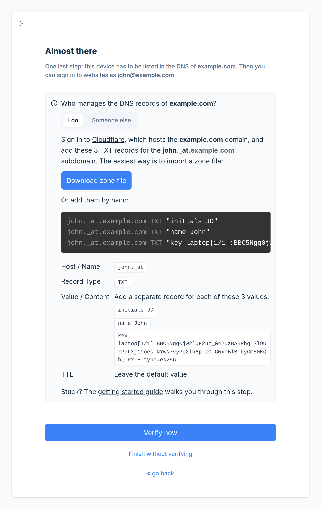
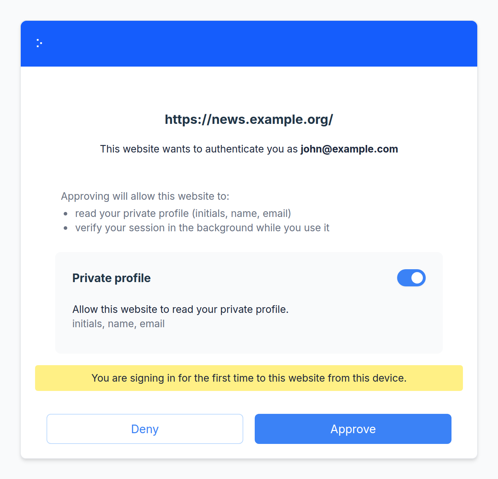
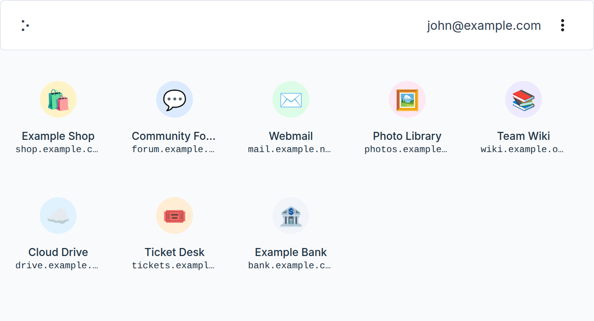

# ⠕ Triauth Authenticator

**No more passwords - sign up and log in to websites with just a click.**

> Triauth Authenticator is part of the [triauth project](https://www.triauth.org/), bringing decentralized, passwordless authentication to everyone.

<p align="center"></p>

<table>
  <tr>
    <td width="33%" valign="top"></td>
    <td width="33%" valign="top"></td>
    <td width="33%" valign="top"></td>
  </tr>
  <tr>
    <td align="center"><sub>Guided setup, DNS records included</sub></td>
    <td align="center"><sub>Approve or deny every sign-in</sub></td>
    <td align="center"><sub>The websites you signed in to, in one place</sub></td>
  </tr>
</table>

## How it works

Triauth Authenticator is a small, free, self-contained web application that lets you manage your identities and keys and approve every "Sign in with triauth" request.
You open it in your web browser like any other website, but everything runs locally: there is no backend and no cloud account.
Your private keys remain on your device and under your control. The matching public keys are published as DNS records under your own domain, which is what proves that an identifier such as `john@example.com` is yours.
You can set up the app to work with biometrics and hardware security keys too.

## Getting started

🌐 **Ready to use at [auth.triauth.org](https://auth.triauth.org)**<br/>
> The triauth project runs the reference instance of this application, so there is nothing to install and no account to create.
> Open it, enter your new or existing identifier (for example `john@example.com`), and the setup guide takes you through the rest, including the DNS records that you, or whoever manages your domain, need to add.
> The server only delivers the application files. Your keys are created and stored in your browser, and every sign-in is approved on your device.

[](https://auth.triauth.org/)

📦 **Prefer to run your own?**<br/>
> Triauth Authenticator is **100% static HTML/JS/CSS** with no backend, so it runs on any static host. You can easily self-host it and point your domain's `triauth` record at your own instance instead.
> The button below deploys it to Cloudflare in a few clicks; Docker and prebuilt releases are covered in [Self-hosting](#self-hosting).

[](https://deploy.workers.cloudflare.com/?url=https://github.com/triauth/triauth-authenticator/tree/production)

📖 **Learn about the triauth protocol at [triauth.org](https://www.triauth.org/), or try a full round trip in the [playground](https://play.triauth.org)**.

## What you can do with it

**🛠 Manage identities and keys** (`index.html`)
> View, add, and remove the identities and cryptographic keys this browser stores on your device.

**🔓 Sign in to websites** (`auth.html`)
> Approve or deny a website's request to sign you in as your identifier (e.g. `john@example.com`).

**✍️ Sign documents** (`sign.html`)
> Review terms of service or any other document, with optional attachments, and produce a transferable signature.

**🏅 Attest** (`attest.html`)
> Skip CAPTCHAs with an "I am not a robot" attestation, or prove anything else about yourself to the website you are visiting, with or without revealing your identity.

**📡 Ping** (`ping.html`)
> Let websites confirm in the background that the session is still in your hands, so a copied session stops working on another device.

**🔖 Stamp** (`stamp.html`)
> Prove to one website that you are already signed in to another, so the services you use can work together.

## Self-hosting

If you prefer to self-host Triauth Authenticator, you have the following options:

> [!IMPORTANT]
> Self-hosting means **you** own the origin that controls how the private keys stored on users' devices are used.
> Keep the instance updated and secure, and don't reuse the hostname for other purposes.
> 
> This repo keeps a dedicated `production` branch pointed at the latest release.
> 
> Give the self-hosted instance its own (sub)domain (e.g. `auth.example.com`) and serve the app at `/` over HTTPS.
> A project-style subpath won't work (e.g. `user.github.io/repo/`).
>
> Finally, ensure your server or host serves files with a secure set of HTTP headers - see [`_headers`](public/_headers) for how they should look.

### Configuration

The app reads a few settings when it is built. Set them in the build settings of your hosting service, pass them to Docker with `--build-arg`, or put them in a `.env` file next to `package.json` before running `npm run build`.

**Which domains the instance serves**

```
VITE_SERVED_DOMAINS=example.com
```

The setup guide and the sign-in pages refuse identifiers under any other domain. An entry also covers its subdomains, so `example.com` serves both `john@example.com` and `john@sales.example.com`. Separate several entries with spaces or commas, or use `*` to serve every domain. When the variable is not set, the instance serves the domain it lives under: `auth.example.com` serves `example.com`.

**Your terms of service and privacy policy**

```
VITE_TERMS_OF_SERVICE_URL=https://www.example.com/legal/terms
VITE_PRIVACY_POLICY_URL=https://www.example.com/legal/privacy
```

The welcome page asks everyone to accept the linked documents on their first visit, and the footer links to them. When they are not set, no documents are linked and nobody is asked to accept anything.

### Option A: Managed static host (e.g. Cloudflare)

Connect your host to this repository's `production` branch with build command `npm run build` and output directory `dist`, or use the button below:

[](https://deploy.workers.cloudflare.com/?url=https://github.com/triauth/triauth-authenticator/tree/production)

### Option B: Docker

The bundled [`Dockerfile`](Dockerfile) builds the app and serves it with [Caddy](https://caddyserver.com/):

```bash
docker build -t triauth-authenticator .
docker run -e DOMAIN=auth.example.com -p 80:80 -p 443:443 triauth-authenticator
```

Set `DOMAIN` to your instance's hostname for automatic Let's Encrypt certificates, or omit it to serve plain HTTP on `:80` behind your own TLS-terminating proxy.

> [!IMPORTANT]
> **A container won't update itself.**
> Nothing inside the image auto-updates, so watch for new releases of Triauth Authenticator, [Caddy's security advisories](https://github.com/caddyserver/caddy/security/advisories), and Alpine CVEs. Rebuild with fresh base images and recreate the container when needed.

### Option C: Prebuilt release

Every release includes a prebuilt `triauth-authenticator-<version>.tar.gz`, a `SHA256SUMS` file, and a build-provenance attestation.

Download, verify, unpack, and serve:

```bash
VERSION=1.0.0-beta.1
REPO=triauth/triauth-authenticator

gh release download "v$VERSION" --repo "$REPO" \
  --pattern 'triauth-authenticator-*.tar.gz' --pattern 'SHA256SUMS'

# Verify checksums match
sha256sum -c SHA256SUMS

# Verify it was built from this source
gh attestation verify triauth-authenticator-*.tar.gz --repo "$REPO"

# Unpack files to /var/www/triauth-authenticator (or use any other dir)
mkdir -p /var/www/triauth-authenticator && tar -xzf triauth-authenticator-*.tar.gz -C /var/www/triauth-authenticator

# then serve /var/www/triauth-authenticator (or the other dir you've picked) at the root of your instance over HTTPS
```

A prebuilt release is built without the settings above. It serves the domain it lives under and links no legal documents. Build from source to change either.

## Copyright and license

Copyright © 2026 The Triauth Authors (https://www.triauth.org/)

Triauth Authenticator is source-available software, free to use and self-host, licensed under the [Elastic License 2.0](LICENSE.txt).

What that means in practice:

- ⚠️ **The software comes as is** - without any warranty, and the licensor shall not be liable for any damages.
- ✅ **Self-host it** - for yourself, your family, your company, or the members of your organization.
- ✅ **Read, audit, and modify it** - the whole app is here, and you can easily build it from source.
- ❌ **Don't offer it to third parties as a hosted or managed service** - e.g. running instances of it for other people as your own product or service.
- ❌ **Don't remove or obscure the licensing and copyright notices** - they must travel with the source and with the built bundle.

This is only a summary. See [LICENSE.txt](LICENSE.txt) for the full terms and the specific language governing permissions and limitations under the License.

### Third-party components

This project also includes third-party components that are distributed under their own licenses.
For a complete list and the full license texts, please see [THIRD-PARTY-NOTICES.txt](THIRD-PARTY-NOTICES.txt).
